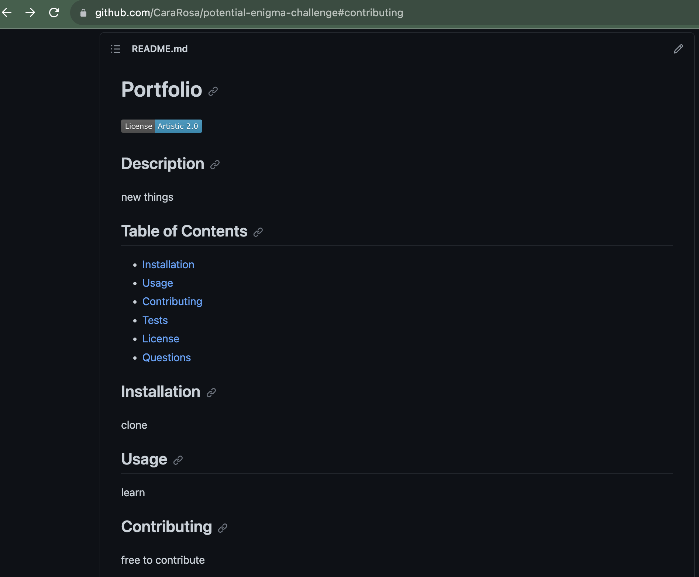

# Generating a README

## Description

This project is designed for users to be able to generate a unique README file based on their input. Users are prompted to answer a series of questions in the terminal. Their answers are then added to the correct section of the README file. The README file will now contain a solid overview of their project.

The README generator has been built using the inquirer package. It challenges students to be able to use inquirer along with JavaScript. It also allows students to practice accessing objects and implement functions.

This is the video that demonstrates how a user can use this application by generating a README:
[README Generator Demo Video](https://drive.google.com/file/d/158bdVfXZO_y8QI0h40kDmt8xqFQAdrGY/view)

## Installation

You can clone or fork this repository to contribute to the project.
Below is a screenshot of the questions in my terminal:

Below are screenshots of a generated README:

.png)

## Credits

Referencing David Grey's (a classmate) README generator code, I realized I needed to call the renderLicenseSection in the part of my code where I create the README. This code can be found in the file generateMarkdown.js which is inside the folder utils. The code added is on line 97. I was having difficulty rendering the Apache License 2.0 and the Artistic License 2.0 badges to the README. My tutor was able to point out that the names of the license were not consistent (ie. Artistic license vs Artistic License). I changed the names of the licenses to have consistent capitalization per his reccomendation. This code can be found in index.js on line 42.

## License

No license is applied to this project.